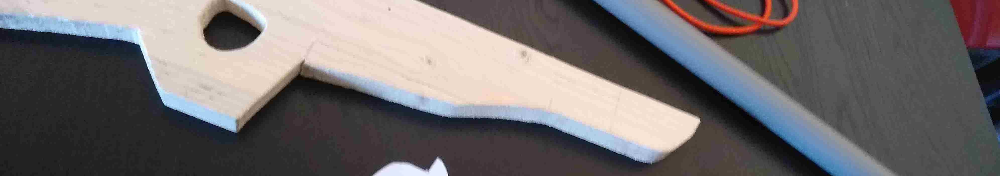

# Potato Gun tutorial (MARK I)
L'objectif de ce tuto est de décrire la réalisation d'un potatogun imaginé avec mon fils. 
L'idée est venu du visionnage d'Iron man 3.
Le potato gun que nous avons réalisé ressemble d'avantage à un fusil.

## pièces :
- pour la crosse: une planche pin : 60cm x 14cm (h: 25mm) 
- pour le canon : tube pvc 32mm x 50cm 
- pour la gachette : une chute de planche 12cm x 6cm (h: 7mm)
- pour le lanceur : une longueur d'environ 50cm l'élastique

## La crosse

Je l'ai découpé dans une planche de pin, type planche de chantier ( L:60cm l:14cm h: 25mm).
puis poncé et enduite de cire teinté pour donner une couleur plus réaliste.
 
Voici le modèle terminé :

## Le canon

## La gachette

## L'élastique
